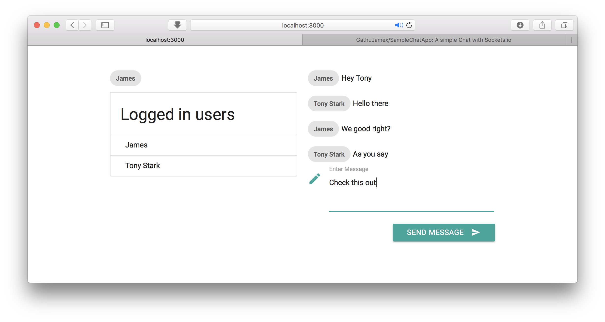

## Sample Chat App
Made using [``socket.io``](https://socket.io)
To set up, run the following upon pulling the code
```bash
npm install
```
configure the ``package.json`` relative to you settings
```bash
node server
```
on your browser visit ``localhost:3000``


